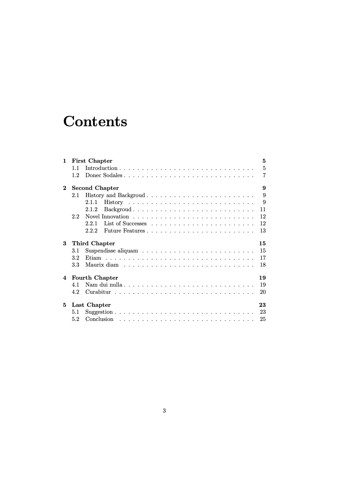

# LAB 03

การใช้งาน LaTeX ในการเตรียมเอกสารประเภทหนังสือ (Book)

## Description

จงเตรียมเอกสารโดยใช้ LaTeX เพื่อให้ได้เอกสารประเภทหนังสือ โดยที่เอกสารที่จัดทำขึ้นต้องประกอบไปด้วยรายการต่อไปนี้

- มีจำนวนบท (Chapter) 5 บท
- มีสารบรรณ (Table of Contents) แสดงรายการของ chapters, sections และ subsections
- ในแต่ละบท ต้องมีเนื้อหาไม่ต่ำกว่า 3 หน้า
- ในแต่ละบท ต้องมี section ที่มีการลำดับเลขที่ อย่างน้อย 2 sections
- ในอย่างน้อย 1 บท ต้องมีการใช้งาน subsubsection
- ในอย่างน้อย 1 บท ต้องมีการใช้งาน section, subsection หรือ subsubsection ที่**ไม่มี** การลำดับเลขที่
- ในอย่างน้อย 1 บท ต้องมีการสร้างรายการแบบมีลำดับ (Ordered List)
- ในอย่างน้อย 1 บท ต้องมีการสร้างรายการแบบไม่มีลำดับ (Unordered List)
- ในอย่างน้อย 1 section ต้องมี subsection ที่มีการลำดับเลขที่ อย่างน้อย 2 subsections

[ตัวอย่างเอกสาร](./doc.pdf)

