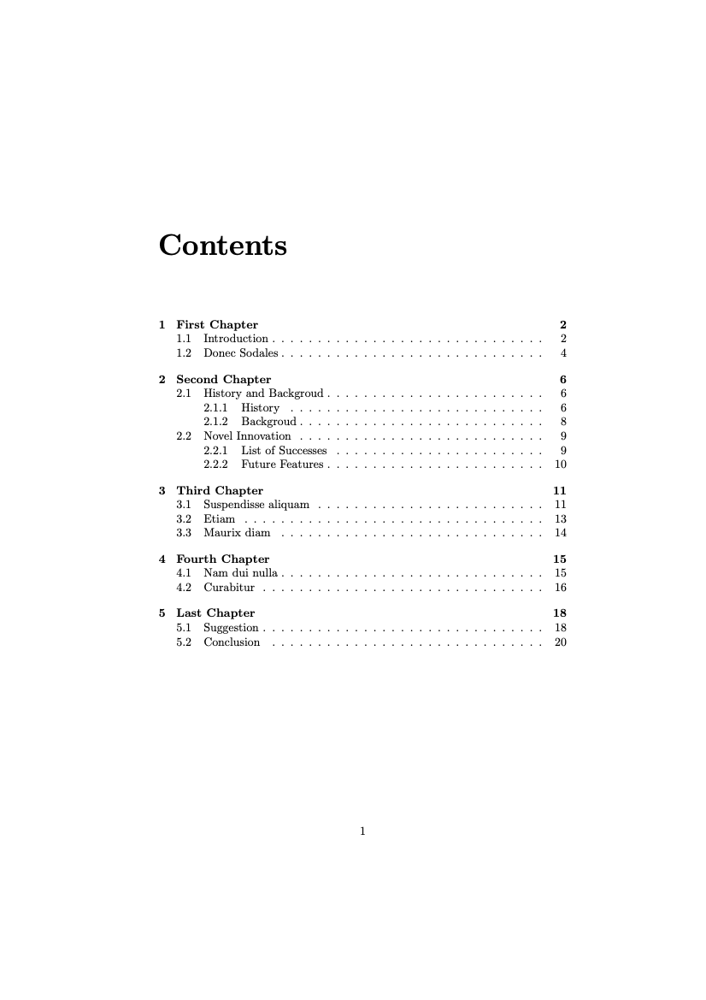

# LAB 04

การใช้งาน LaTeX ในการเตรียมเอกสารประเภทรายงาน (report)

## Description

จงเตรียมเอกสารโดยใช้ LaTeX เพื่อให้ได้เอกสารประเภทรายงาน 
โดยให้เลือกเนื้อหาจากหัวข้อต่อไปนี้ 1 หัวข้อ:
- [Snow White and the Seven Dwarfs](https://en.wikipedia.org/wiki/Snow_White_and_the_Seven_Dwarfs_(1937_film))
- [Alice's Adventures in Wonderland](https://en.wikipedia.org/wiki/Alice%27s_Adventures_in_Wonderland)
- [Beauty and the Beast](https://en.wikipedia.org/wiki/Beauty_and_the_Beast_(1991_film))
- [The Lion King](https://en.wikipedia.org/wiki/The_Lion_King)
- [Frozen](https://en.wikipedia.org/wiki/Frozen_(2013_film))

ทั้งนี้นักศึกษาสามารถจัดลำดับเนื้อหาได้ตามความเหมาะสม แต่เอกสารยังคงต้องประกอบด้วยรายการต่อไปนี้:
- Chapters/Sections (ลำดับตามความเหมาะสม)
- Table of contents แสดง Chapters/Sections
- มีปกรายรายงาน แสดงถึง ชื่อเรื่อง/ผู้จัดทำรายงาน (ชื่อของนักศึกษา)/วันที่จัดทำ

[ตัวอย่างเอกสาร](./doc.pdf)

