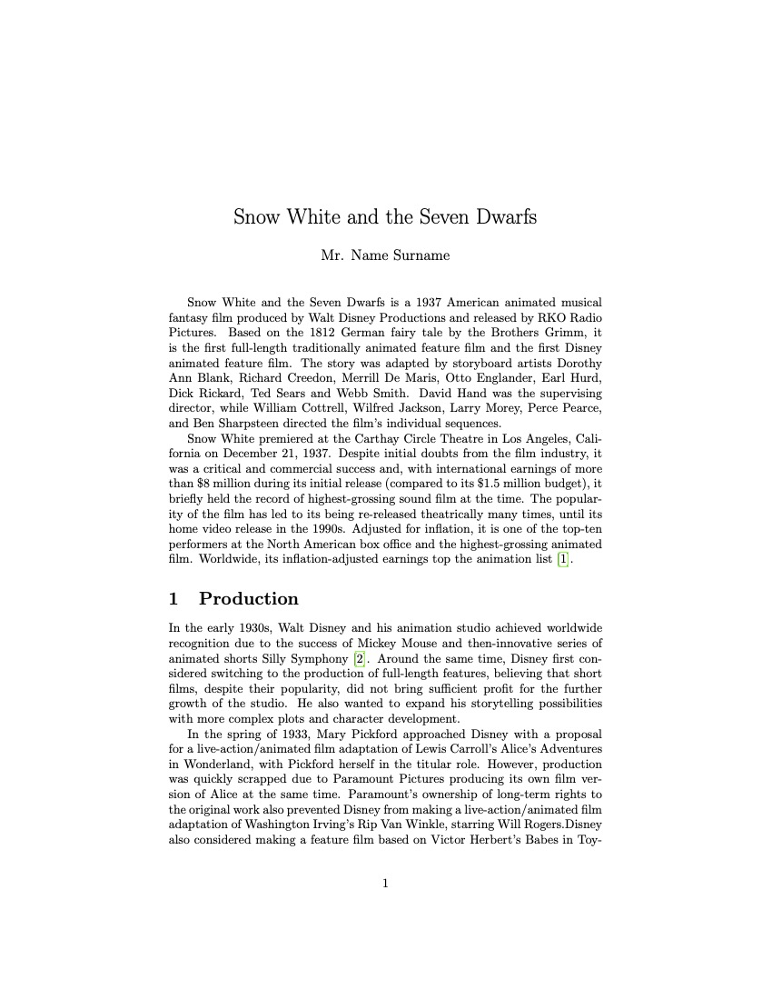
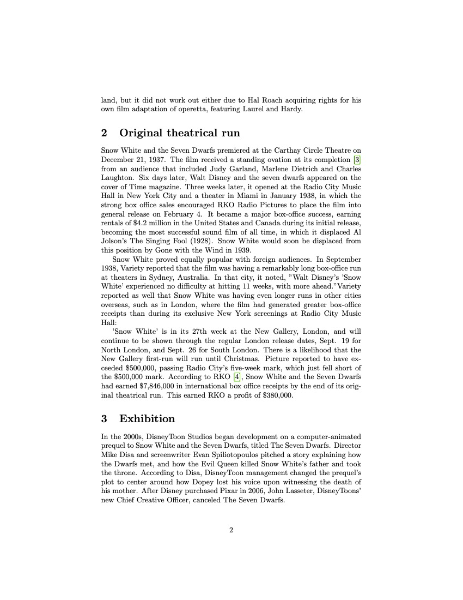
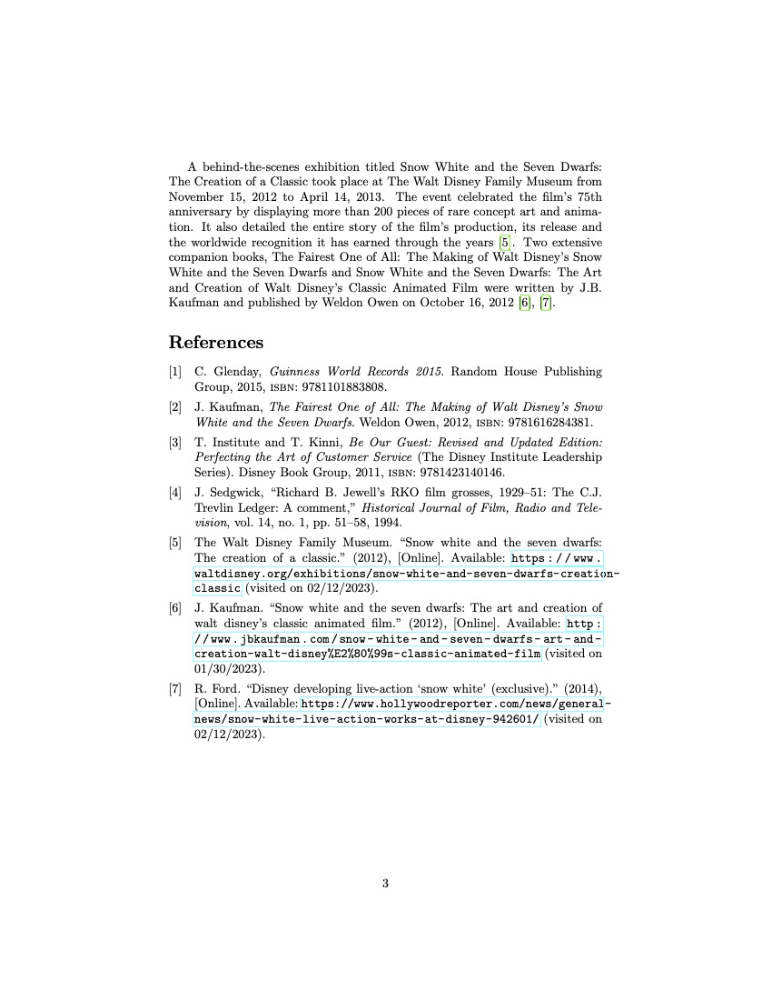

# LAB 08

การจัดการเอกสารอ้างอิง และเรียงพิมพ์บรรณานุกรม

## Description

จงเตรียมเอกสารโดยใช้ LaTeX เพื่อให้ได้ผลลัพธ์ดัง[ชิ้นงานที่กำหนดให้](./doc.pdf)

## Resource

### Snow White and the Seven Dwarfs

Mr. Name Surname

Snow White and the Seven Dwarfs is a 1937 American animated musical fantasy film produced by Walt Disney Productions and released by RKO Radio Pictures. Based on the 1812 German fairy tale by the Brothers Grimm, it is the first full-length traditionally animated feature film and the first Disney animated feature film. The story was adapted by storyboard artists Dorothy Ann Blank, Richard Creedon, Merrill De Maris, Otto Englander, Earl Hurd, Dick Rickard, Ted Sears and Webb Smith. David Hand was the supervising director, while William Cottrell, Wilfred Jackson, Larry Morey, Perce Pearce, and Ben Sharpsteen directed the film’s individual sequences.
Snow White premiered at the Carthay Circle Theatre in Los Angeles, Cali- fornia on December 21, 1937. Despite initial doubts from the film industry, it was a critical and commercial success and, with international earnings of more than $8 million during its initial release (compared to its $1.5 million budget), it briefly held the record of highest-grossing sound film at the time. The popular- ity of the film has led to its being re-released theatrically many times, until its home video release in the 1990s. Adjusted for inflation, it is one of the top-ten performers at the North American box office and the highest-grossing animated film. Worldwide, its inflation-adjusted earnings top the animation list [1].

### 1 Production

In the early 1930s, Walt Disney and his animation studio achieved worldwide recognition due to the success of Mickey Mouse and then-innovative series of animated shorts Silly Symphony [2]. Around the same time, Disney first con- sidered switching to the production of full-length features, believing that short films, despite their popularity, did not bring sufficient profit for the further growth of the studio. He also wanted to expand his storytelling possibilities with more complex plots and character development.
In the spring of 1933, Mary Pickford approached Disney with a proposal for a live-action/animated film adaptation of Lewis Carroll’s Alice’s Adventures in Wonderland, with Pickford herself in the titular role. However, production was quickly scrapped due to Paramount Pictures producing its own film ver- sion of Alice at the same time. Paramount’s ownership of long-term rights to the original work also prevented Disney from making a live-action/animated film adaptation of Washington Irving’s Rip Van Winkle, starring Will Rogers.Disney also considered making a feature film based on Victor Herbert’s Babes in Toyland, but it did not work out either due to Hal Roach acquiring rights for his own film adaptation of operetta, featuring Laurel and Hardy.

### 2 Original theatrical run
Snow White and the Seven Dwarfs premiered at the Carthay Circle Theatre on December 21, 1937. The film received a standing ovation at its completion [3] from an audience that included Judy Garland, Marlene Dietrich and Charles Laughton. Six days later, Walt Disney and the seven dwarfs appeared on the cover of Time magazine. Three weeks later, it opened at the Radio City Music Hall in New York City and a theater in Miami in January 1938, in which the strong box office sales encouraged RKO Radio Pictures to place the film into general release on February 4. It became a major box-office success, earning rentals of $4.2 million in the United States and Canada during its initial release, becoming the most successful sound film of all time, in which it displaced Al Jolson’s The Singing Fool (1928). Snow White would soon be displaced from this position by Gone with the Wind in 1939.
Snow White proved equally popular with foreign audiences. In September 1938, Variety reported that the film was having a remarkably long box-office run at theaters in Sydney, Australia. In that city, it noted, ”Walt Disney’s ’Snow White’ experienced no difficulty at hitting 11 weeks, with more ahead.”Variety reported as well that Snow White was having even longer runs in other cities overseas, such as in London, where the film had generated greater box-office receipts than during its exclusive New York screenings at Radio City Music Hall: ’Snow White’ is in its 27th week at the New Gallery, London, and will continue to be shown through the regular London release dates, Sept. 19 for North London, and Sept. 26 for South London. There is a likelihood that the New Gallery first-run will run until Christmas. Picture reported to have ex- ceeded $500,000, passing Radio City’s five-week mark, which just fell short of the $500,000 mark. According to RKO [4], Snow White and the Seven Dwarfs had earned $7,846,000 in international box office receipts by the end of its orig- inal theatrical run. This earned RKO a profit of $380,000.

### 3 Exhibition
In the 2000s, DisneyToon Studios began development on a computer-animated prequel to Snow White and the Seven Dwarfs, titled The Seven Dwarfs. Director Mike Disa and screenwriter Evan Spiliotopoulos pitched a story explaining how the Dwarfs met, and how the Evil Queen killed Snow White’s father and took the throne. According to Disa, DisneyToon management changed the prequel’s plot to center around how Dopey lost his voice upon witnessing the death of his mother. After Disney purchased Pixar in 2006, John Lasseter, DisneyToons’ new Chief Creative Officer, canceled The Seven Dwarfs.

A behind-the-scenes exhibition titled Snow White and the Seven Dwarfs: The Creation of a Classic took place at The Walt Disney Family Museum from November 15, 2012 to April 14, 2013. The event celebrated the film’s 75th anniversary by displaying more than 200 pieces of rare concept art and anima- tion. It also detailed the entire story of the film’s production, its release and the worldwide recognition it has earned through the years [5]. Two extensive companion books, The Fairest One of All: The Making of Walt Disney’s Snow White and the Seven Dwarfs and Snow White and the Seven Dwarfs: The Art and Creation of Walt Disney’s Classic Animated Film were written by J.B. Kaufman and published by Weldon Owen on October 16, 2012 [6], [7].

### References
[1] C. Glenday, Guinness World Records 2015. Random House Publishing Group, 2015, isbn: 9781101883808.

[2] J. Kaufman, The Fairest One of All: The Making of Walt Disney’s Snow White and the Seven Dwarfs. Weldon Owen, 2012, isbn: 9781616284381.

[3] T. Institute and T. Kinni, Be Our Guest: Revised and Updated Edition: Perfecting the Art of Customer Service (The Disney Institute Leadership Series). Disney Book Group, 2011, isbn: 9781423140146.

[4] J. Sedgwick, “Richard B. Jewell’s RKO film grosses, 1929–51: The C.J. Trevlin Ledger: A comment,” Historical Journal of Film, Radio and Tele- vision, vol. 14, no. 1, pp. 51–58, 1994.

[5] The Walt Disney Family Museum. “Snow white and the seven dwarfs: The creation of a classic.” (2012), [Online]. Available: https://www.waltdisney.org/exhibitions/snow-white-and-seven-dwarfs-creation-classic (visited on 02/12/2023).

[6] J. Kaufman. “Snow white and the seven dwarfs: The art and creation of walt disney’s classic animated film.” (2012), [Online]. Available: http://www.jbkaufman.com/snow-white-and-seven-dwarfs-art-and-creation-walt-disney%E2%80%99s-classic-animated-film (visited on 01/30/2023).

[7] R. Ford. “Disney developing live-action ‘snow white’ (exclusive).” (2016), [Online]. Available: https://www.hollywoodreporter.com/news/general-news/snow-white-live-action-works-at-disney-942601/ (visited on 02/12/2023).

